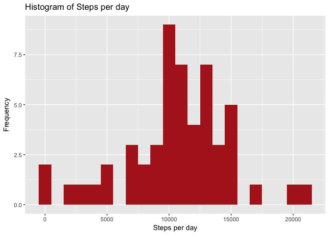
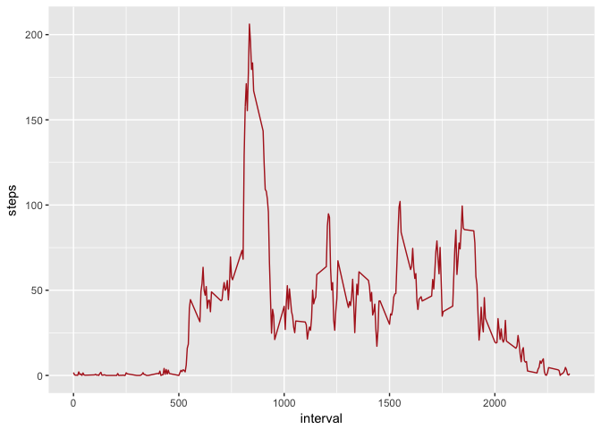
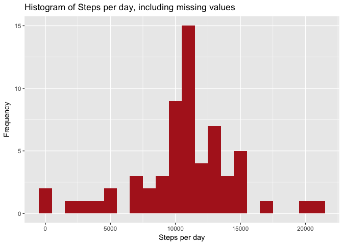
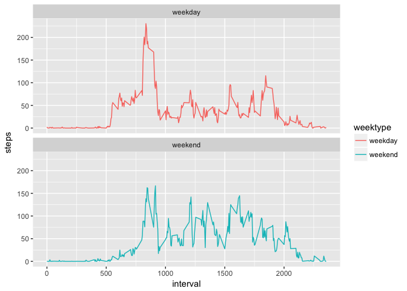

## Summary

This assignment makes use of data from a personal activity monitoring device. This device collects data at 5 minute intervals through out the day. The data consists of two months of data from an anonymous individual collected during the months of October and November, 2012 and include the number of steps taken in 5 minute intervals each day.

The data for this assignment can be downloaded from the course web site:

Dataset: Activity monitoring data
[data](https://d396qusza40orc.cloudfront.net/repdata%2Fdata%2Factivity.zip)

The variables included in this dataset are:

*steps*: Number of steps taking in a 5-minute interval (missing values are coded as 𝙽𝙰)
date: The date on which the measurement was taken in YYYY-MM-DD format
*interval*: Identifier for the 5-minute interval in which measurement was taken
The dataset is stored in a comma-separated-value (CSV) file and there are a total of 17,568 observations in this dataset.

## Loading and preprocessing the data

loading packages


We will unzip and load the data using read.csv
Set working directory

```r
setwd("~/rProgramming/coursera/reproducibleResearch/RepData_PeerAssessment1") ##
```


```r
unzip("activity.zip")
data <- read.csv("activity.csv", header = TRUE, sep = ',', colClasses = c("numeric", "character","integer"))
```
Tide the data


```r
data$date <- ymd(data$date)
```

## What is mean total number of steps taken per day?

Ignore the missing values, calculae the total number of steps taken per day and make an historgram of total number of steps calculated per day. Caclulate mean, median and total number of steps.


```r
steps <- data %>%
  filter(!is.na(steps)) %>%
  group_by(date) %>%
  summarize(steps = sum(steps)) %>%
  print
```

```
## # A tibble: 53 x 2
##          date steps
##        <date> <dbl>
##  1 2012-10-02   126
##  2 2012-10-03 11352
##  3 2012-10-04 12116
##  4 2012-10-05 13294
##  5 2012-10-06 15420
##  6 2012-10-07 11015
##  7 2012-10-09 12811
##  8 2012-10-10  9900
##  9 2012-10-11 10304
## 10 2012-10-12 17382
## # ... with 43 more rows
```

#Plot the results

```r
ggplot(steps, aes(x = steps)) +
geom_histogram(fill = "firebrick", binwidth = 1000) +
labs(title = "Histogram of Steps per day", x = "Steps per day", y = "Frequency")
```

<!-- -->

Calculating the mean and median


```r
mean_steps <- mean(steps$steps, na.rm = TRUE)
median_steps <- median(steps$steps, na.rm = TRUE)
```

mean_steps

```r
mean_steps
```

```
## [1] 10766.19
```
median_steps

```r
median_steps
```

```
## [1] 10765
```

#  What is the average daily activity pattern?

Calculating the average steps

```r
interval <- data %>%
  filter(!is.na(steps)) %>%
  group_by(interval) %>%
  summarize(steps = mean(steps))
```

Ploting the graph

```r
ggplot(interval, aes(x=interval, y=steps)) +
  geom_line(color = "firebrick")
```

<!-- -->

Finding the max step

```r
interval[which.max(interval$steps),]
```

```
## # A tibble: 1 x 2
##   interval    steps
##      <int>    <dbl>
## 1      835 206.1698
```

## Imputing missing values

Calculate and report the total number of missing values, fillin all missing values and create a new dataset. Make a histogram of total number of steps per day and recaclculate mean and median number of total steps per day. Compare against the first calculations.

Filing missing values

```r
data_full <- data
nas <- is.na(data_full$steps)
avg_interval <- tapply(data_full$steps, data_full$interval, mean, na.rm=TRUE, simplify=TRUE)
data_full$steps[nas] <- avg_interval[as.character(data_full$interval[nas])]
```

Calculating the steps

```r
steps_full <- data_full %>%
  filter(!is.na(steps)) %>%
  group_by(date) %>%
  summarize(steps = sum(steps)) %>%
  print
```

```
## # A tibble: 61 x 2
##          date    steps
##        <date>    <dbl>
##  1 2012-10-01 10766.19
##  2 2012-10-02   126.00
##  3 2012-10-03 11352.00
##  4 2012-10-04 12116.00
##  5 2012-10-05 13294.00
##  6 2012-10-06 15420.00
##  7 2012-10-07 11015.00
##  8 2012-10-08 10766.19
##  9 2012-10-09 12811.00
## 10 2012-10-10  9900.00
## # ... with 51 more rows
```

Plotting the graph

```r
ggplot(steps_full, aes(x = steps)) +
  geom_histogram(fill = "firebrick", binwidth = 1000) +
  labs(title = "Histogram of Steps per day, including missing values", x = "Steps per day", y = "Frequency")
```

<!-- -->

Calculate the mean and median

```r
mean_steps_full <- mean(steps_full$steps, na.rm = TRUE)
median_steps_full <- median(steps_full$steps, na.rm = TRUE)
```

mean_steps_full

```r
mean_steps_full
```

```
## [1] 10766.19
```

## Are there differences in activity patterns between weekdays and weekends?

Create a new factor variable in the dataset with weekday and weekend.
Make a plot containing time series plot.

Weekday or weekend

```r
data_full <- mutate(data_full, weektype = ifelse(weekdays(data_full$date) == "Saturday" | weekdays(data_full$date) == "Sunday", "weekend", "weekday"))
data_full$weektype <- as.factor(data_full$weektype)
head(data_full)
```

```
##       steps       date interval weektype
## 1 1.7169811 2012-10-01        0  weekday
## 2 0.3396226 2012-10-01        5  weekday
## 3 0.1320755 2012-10-01       10  weekday
## 4 0.1509434 2012-10-01       15  weekday
## 5 0.0754717 2012-10-01       20  weekday
## 6 2.0943396 2012-10-01       25  weekday
```

Average steps in 5 min intervals

```r
interval_full <- data_full %>%
  group_by(interval, weektype) %>%
  summarise(steps = mean(steps))
```

Ploting the graph

```r
s <- ggplot(interval_full, aes(x=interval, y=steps, color = weektype)) +
  geom_line() +
  facet_wrap(~weektype, ncol = 1, nrow=2)
print(s)
```

<!-- -->
